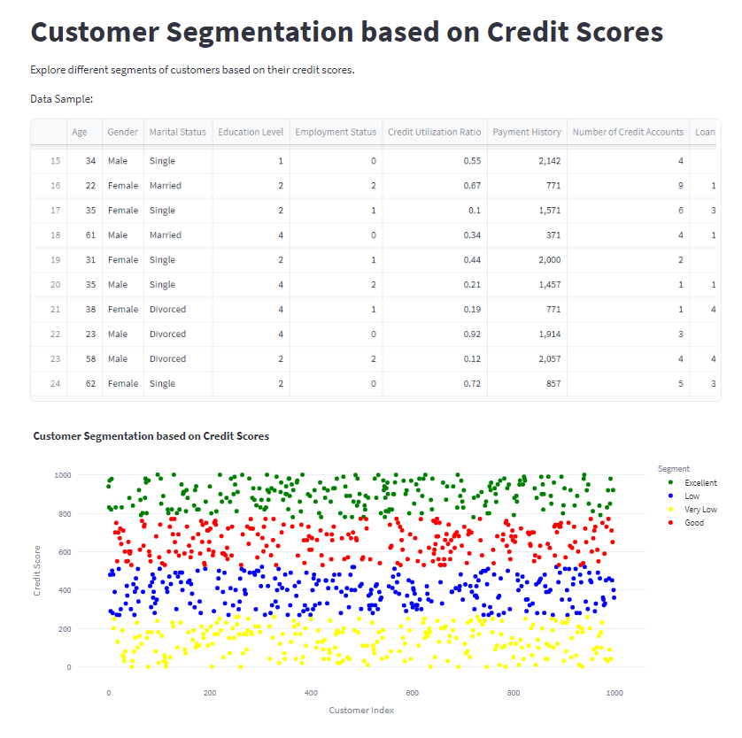

# Credit Score Segmentation App

This is a Streamlit web application that performs customer segmentation based on credit scores using KMeans clustering. The app loads credit scoring data from a CSV file, processes it, calculates credit scores, and then applies KMeans clustering to segment customers into different categories based on their credit scores.

## Table of Contents

- [Installation](#installation)
- [Usage](#usage)
- [Dependencies](#dependencies)
- [Screenshots](#screenshots)
- [Contributing](#contributing)
- [License](#license)

## Installation

1. Clone the repository or download the source code.

```bash
git clone https://github.com/Mohshaikh23/Credit-Scoring-and-Segmentation.git
```

Navigate to the project directory.

```bash
cd credit-score-segmentation-app
```

Install the required dependencies using pip.

```bash
pip install -r requirements.txt
```

Usage
Run the Streamlit app using the following command:

```bash
streamlit run credit_score_app.py
```

This will open a new tab in your web browser where you can interact with the app. The app allows you to explore different segments of customers based on their credit scores.

Dependencies
The app uses the following Python libraries and frameworks:

```bash
Streamlit
Pandas
Plotly Express
scikit-learn
```

For specific versions, refer to the requirements.txt file.

Screenshots


Contributing
Contributions are welcome! If you have any suggestions, improvements, or bug fixes, feel free to open an issue or submit a pull request.

License
This project is licensed under the MIT License.